# BrewGo — застосунок для замовлення кави на самовивіз

Наскрізний проєкт магістратури GoIt Neoversity. Користувач переглядає меню, налаштовує
напій, оплачує в застосунку і забирає готове у вказаний час без черги.

Проєкт пройшов повний шлях: макет у Figma → базові компоненти → навігація → інтеграція
REST API → розділення глобального стану → оптимізація продуктивності → фінальне
розширення функціоналу. Цей README описує застосунок у підсумковому стані.

| | | |
| --- | --- | --- |
| 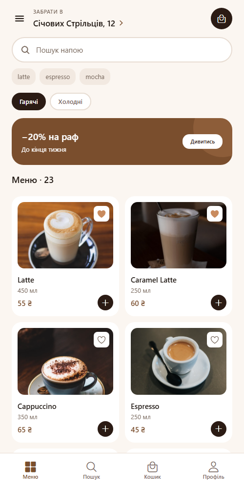 | 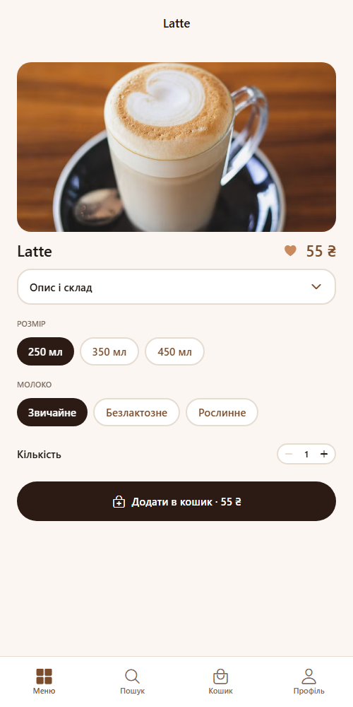 | 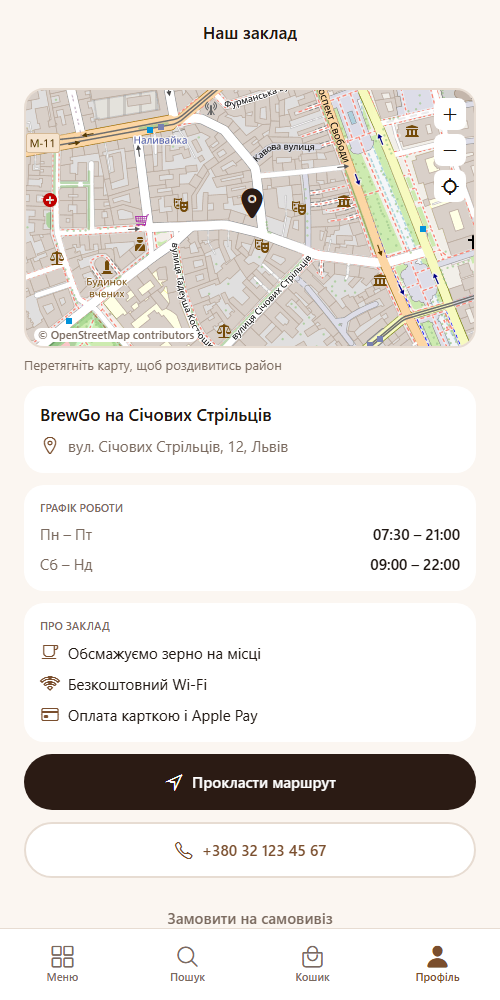 |
| Меню з API | Картка напою | Заклад на карті |

## Стек

Expo SDK 57 · React Native 0.86 · React 19 · React Navigation 7 · Redux Toolkit 2 ·
Reanimated 4 · AsyncStorage 2

## Запуск

```bash
npm install
npm start
```

Далі `a` — Android, `i` — iOS, `w` — web.

## Структура

```
api/          запити до REST API і мапер відповіді
components/   UI-компоненти, кожен в окремому файлі
context/      ThemeContext — тема через Context API
data/         підказки пошуку, дані закладу
dev/          лічильник рендерів для замірів, вимкнений за замовчуванням
hooks/        useRequest і обгортки над ним, useCardWidth, useBootstrap, useRenderLog
navigation/   навігатори, константи маршрутів, спільні опції, deep links
screens/      екрани застосунку
storage/      читання й запис збереженого стану
store/        слайси Redux, конфігурація, middleware персистентності
theme/        палітри, типографіка, відступи, радіуси, тіні
utils/        форматування дат, математика картографічних тайлів
```

## Можливості

| Розділ | Що вміє |
| --- | --- |
| Меню | 29 напоїв з REST API — 23 гарячих і 6 холодних, пошук, сітка 2–3 колонки залежно від ширини екрана |
| Картка напою | Опис і склад у згортному блоці, вибір обʼєму та молока, кількість, додавання в кошик |
| Кошик | Зміна кількості, видалення, сума й лічильник із селекторів, порожній стан |
| Оформлення | Час самовивозу, спосіб оплати, підтвердження з номером і датою замовлення |
| Історія замовлень | Реальні замовлення, деталі в модальному вікні, підтвердження отримання, повтор одним натисканням |
| Улюблене | Сердечко на картці й у деталях, окремий екран, переживає перезапуск |
| Заклад | Інтерактивна карта, графік роботи, маршрут і дзвінок |
| Профіль | Бонусна картка з реального лічильника стаканів, перемикач теми, входи в розділи |
| Тема | Світла й темна, наскрізна, зберігається між запусками |

## Архітектура

### Розподіл глобального стану

| Аспект | Інструмент | Чому так |
| --- | --- | --- |
| Тема | Context API | Читається майже кожним компонентом і змінюється одним перемикачем. Редюсери й екшени тут були б зайвою церемонією |
| Кошик | Redux Toolkit | Змінюється з пʼяти екранів, має пʼять операцій і похідні значення — лічильник у табі та сума |
| Замовлення | Redux Toolkit | Створюються на оформленні, читаються на підтвердженні, в історії та в профілі. Похідні: лічильник стаканів для бонусної картки |
| Улюблене | Redux Toolkit | Перемикається з трьох екранів — меню, деталі напою і сам список улюбленого, читається ще й у профілі. Дрібне за обсягом, але живе поруч із кошиком і замовленнями й зберігається тим самим механізмом |
| Меню з API | локальний стан екрана | Свідомо **не** виносив у глобальний стан: дані залежать від обраної категорії, а екрани меню й пошуку тримають кожен свій вибір |

### Тема через фабрики стилів

`StyleSheet.create` створює статичний обʼєкт і зафіксував би кольори однієї теми
назавжди. Тому в кожному компоненті стилі оголошені як фабрика:

```js
const { colors } = useTheme();
const styles = useMemo(() => createStyles(colors), [colors]);
```

Дві палітри з однаковими ключами лежать у `theme/palettes.js`, тому компонент не знає,
яка тема активна. Так само зроблені опції навігації й варіанти кнопки.

### Навігація

```
Drawer
├── Tabs
│   ├── Меню    → MenuStack:    Home → ProductDetails → Venue
│   ├── Пошук   → SearchStack:  Search → ProductDetails
│   ├── Кошик   → CartStack:    Cart → Checkout → Confirmation
│   └── Профіль → ProfileStack: Profile → OrderHistory → Favorites → Venue
├── Підтримка
└── Про заклад
```

Назви маршрутів — тільки через константи `SCREENS` / `STACKS` / `DRAWER`.
Екран закладу зареєстрований у двох стеках — так само, як картка напою розділена між
меню й пошуком: адреса в шапці відкриває його без стрибка на інший таб.

Передача параметрів свідомо мінімальна: між екранами подорожує **ідентифікатор**, а не
обʼєкт. Деталі напою отримують `drinkId` і `category`, підтвердження замовлення —
`orderId`, а самі дані читаються з API або зі стора. Тому екран, відкритий за прямим
посиланням, показує те саме, що й після переходу всередині застосунку.

**Deep links.** На web у кожного екрана є URL: `/menu`, `/menu/:drinkId`, `/menu/venue`,
`/search`, `/search/:drinkId`, `/cart`, `/checkout`, `/confirmation`, `/profile`,
`/orders`, `/favorites`, `/venue`, `/support`, `/about`.

### Робота з API

`https://api.sampleapis.com/coffee` — публічний, без ключа. Запит обгорнутий
`AbortController` з таймаутом 10 с, помилки розділені на три випадки: немає мережі,
таймаут, неіснуючий напій — кожен зі своїм текстом.

Спільний життєвий цикл запиту винесений у `hooks/useRequest.js`: три стани в одному
переході через `useReducer` і захист від застарілої відповіді, якщо швидко перемкнути
категорію. `useCoffeeMenu` і `useFavoriteDrinks` — тонкі обгортки над ним.

**Категорія — частина ідентичності напою.** Ендпоінти `/hot` і `/iced` перевикористовують
однакові `id`: чотири з них збігаються. Тому напій ідентифікується парою
`category + id`, а не самим `id`. Інакше кошик зливав би різні напої в одну позицію, а
сердечко на гарячому латте позначало б і холодний напій.

## Персистентність

Кошик, замовлення, улюблене й тема переживають перезапуск застосунку.

Зроблено без `redux-persist`: механізм займає близько сорока рядків, а додавати
залежність одразу після роботи зі зменшення бандла було б непослідовно.

| Частина | Роль |
| --- | --- |
| `storage/persistence.js` | Читання й запис JSON, дебаунс 300 мс, ключі з версією |
| `store/persistMiddleware.js` | Пише зріз стану після кожної дії, крім самої гідратації |
| `store/hydrate.js` | Одна дія, яку кожен слайс розбирає сам у `extraReducers` |
| `hooks/useBootstrap.js` | Читає сховище до першого кадру |

Слайси не знають один про одного: щоб додати новий персистентний слайс, достатньо
описати його випадок у `extraReducers` — код завантаження не змінюється.

Дебаунс потрібен, бо степер кількості встигає надіслати кілька дій за секунду, і кожна
з них інакше писала б на диск.

Провайдер теми монтується **після** того, як збережений режим прочитано. `initialMode`
задає лише початковий стан `useState`, тож при ранішому монтуванні провайдер стартував
би у світлій темі й одразу перезаписував би збережене значення.

## Продуктивність

| Захід | Результат |
| --- | --- |
| `React.memo` на картках, рядках і компонентах шапки | Набір слова в пошуку: 42 → 16 рендерів `ProductCard` |
| `useCallback` на колбеках списків | Зміна кількості: 10 → 5 рендерів `CartItem` |
| `useMemo` на фільтрації та складених стилях | Фільтрація не повторюється на кожному рендері |
| Точковий імпорт `@expo/vector-icons/Ionicons` | У збірку потрапляє один набір іконок замість пʼятнадцяти: −417 КіБ JS і −3,5 МіБ шрифтів |

Бочковий імпорт `@expo/vector-icons` підключав усі 15 наборів іконок разом із
гліф-мапами та шрифтами, хоча застосунок використовує один набір.

Компоненти, що читають стор, підписуються самостійно там, де це важливо: `FavoriteButton`
бере свій прапорець із стора замість того, щоб отримувати його пропсом. Інакше кожне
натискання сердечка створювало б нові пропси для всієї сітки й зводило б `memo` нанівець.

`SearchBar` свідомо лишений без `memo`: його `value` змінюється на кожен символ, тож
порівняння пропсів завжди провалювалось би — це були б витрати без користі.

Перевірка — лічильник рендерів у `dev/`. Він вимкнений константою `SHOW_RENDER_STATS` і
закритий `__DEV__`; у продакшн-збірці Metro викидає його разом із текстами панелі.

## Анімації

Усі через Reanimated (`useSharedValue`, `useAnimatedStyle`). `LayoutAnimation` не
використовується: у `react-native-web` його `configureNextLayoutAnimation` лише викликає
колбек, тож на web анімації не було б.

| Компонент | Що анімовано |
| --- | --- |
| `Collapsible` | Висота блоку «Опис і склад» і поворот шеврона від одного shared value |
| `Badge` | Лічильник кошика підскакує при зміні й осідає назад |
| `CartItem` | Поява й зникання позиції, решта рядків зʼїжджає на місце |
| `FavoriteButton` | Пружина сердечка при перемиканні |
| `LoyaltyProgress` | Заповнення смуги бонусної картки |
| `BottomSheetModal` | Виїзд знизу з затемненням тла |
| `VenueMap` | Перетягування карти та повернення до точки |

## Інтерактивна карта

`react-native-maps` не має реалізації для web, а застосунок має працювати і в браузері.
Тому карта зібрана з растрових тайлів OpenStreetMap без картографічної залежності:

- `utils/tiles.js` — проєкція Web Mercator, переведення координат у тайлову сітку
- `components/VenueMap.jsx` — сітка 5×5 тайлів, жест `Pan` із обмеженням країв,
  кнопки масштабу й повернення до точки

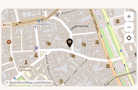

Атрибуція «© OpenStreetMap contributors» виводиться на карті, як вимагають умови
використання тайлів.

## Ключові екрани

### Замовлення

Оформлення створює справжнє замовлення: позиції копіюються з кошика, кошик очищається,
а підтвердження читає замовлення зі стора за `orderId`.

| | | |
| --- | --- | --- |
| 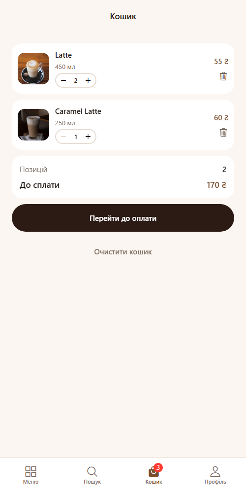 | 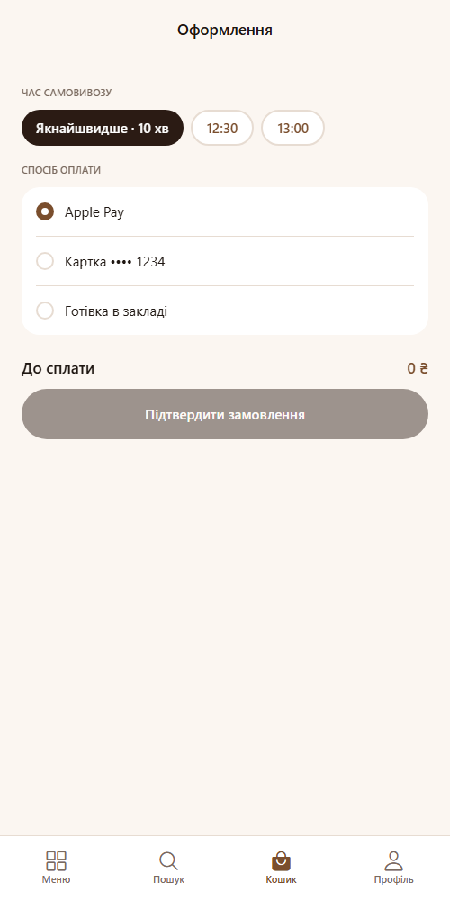 | 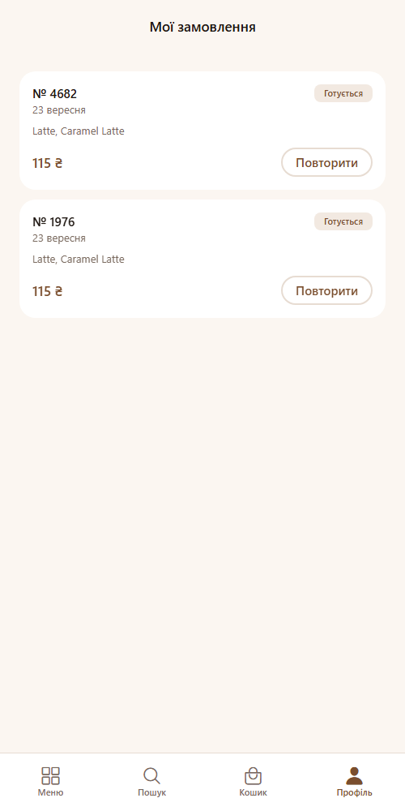 |

Позиції копіюються в замовлення цілком, а не посиланням на меню: історія має показувати,
що саме було куплено, навіть якщо меню або ціни згодом зміняться.

Деталі замовлення відкриваються в модальному вікні, звідти ж можна повторити замовлення:

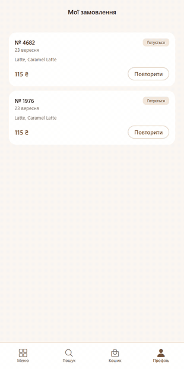

Повтор кладе збережені позиції назад у кошик без жодного запиту до API — у замовленні
вже є все, що потрібно рядку кошика.

Звідти ж замовлення позначається отриманим і переходить зі статусу «Готується» у
«Виконано». Підтверджує користувач, бо без бекенда нікому повідомити, що напій готовий.

### Улюблене й профіль

| | |
| --- | --- |
| 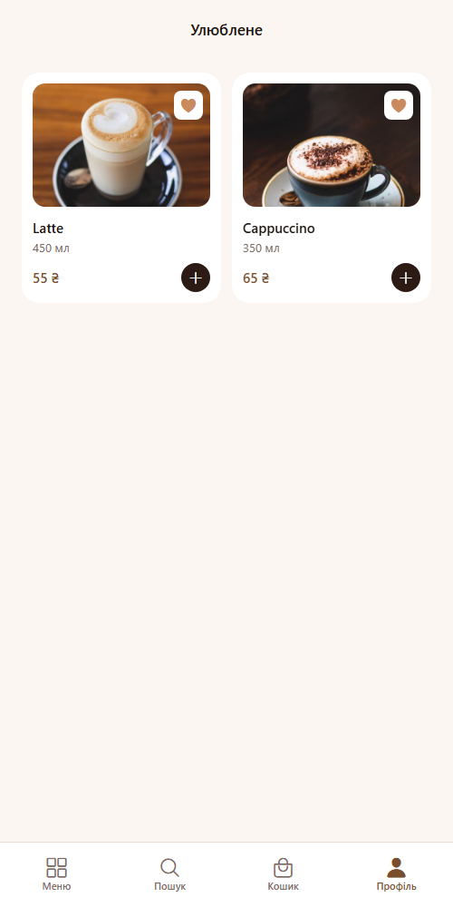 | 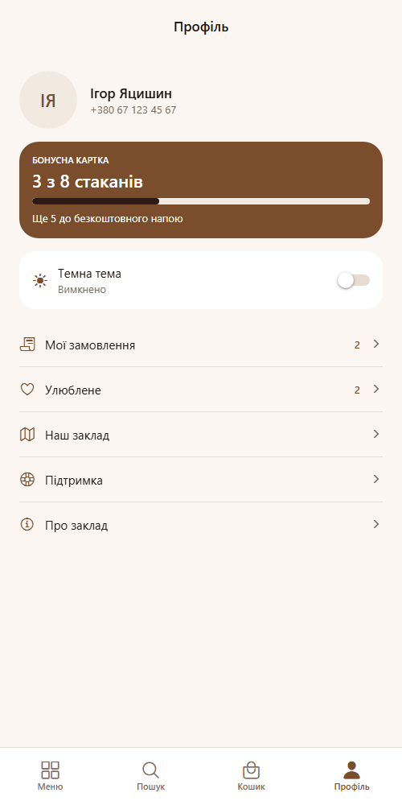 |

Улюблене зберігає лише ідентифікатори — назви, ціни й фото приходять з API і застаріли б
на диску. Бонусна картка рахує справжні стакани з оформлених замовлень.

### Анімації в дії

| | | |
| --- | --- | --- |
| 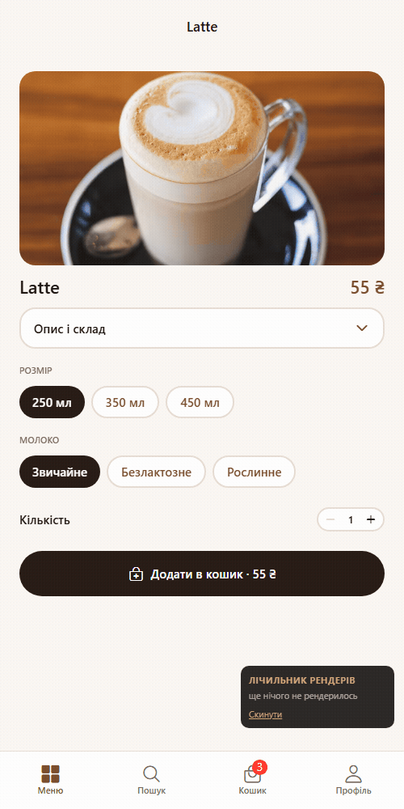 | 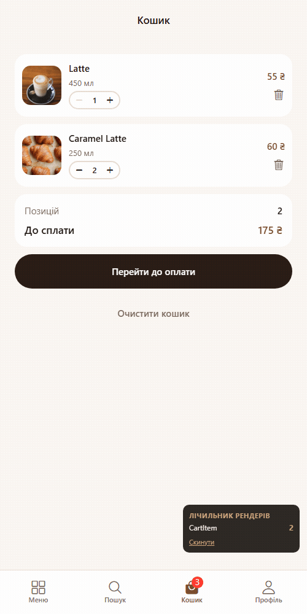 |  |
| Опис напою | Видалення з кошика | Лічильник кошика |

### Темна тема

Тема застосована наскрізно — до екранів, компонентів, заголовків стеків і таб-бару.

| | | |
| --- | --- | --- |
| 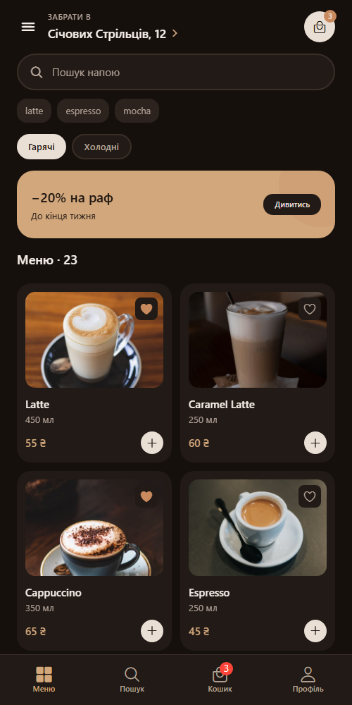 | 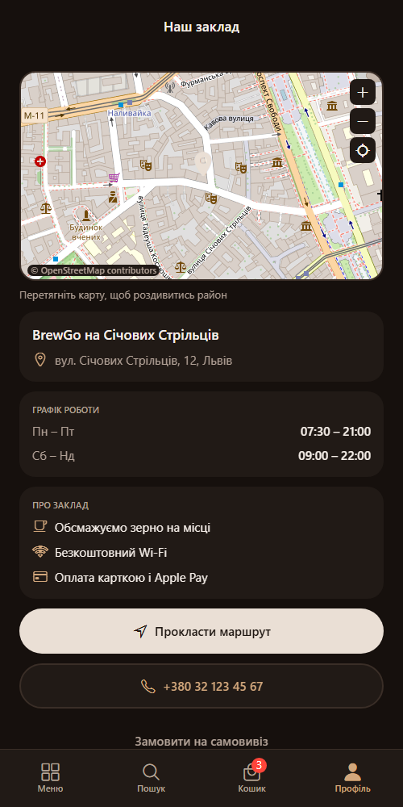 | 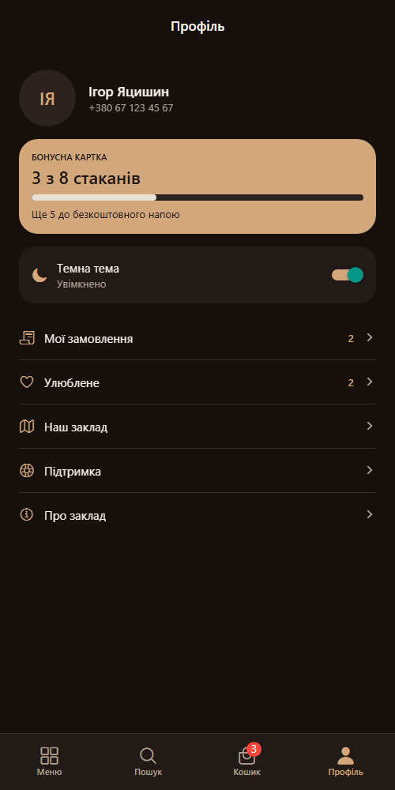 |

Ключі `espresso` і `textOnDark` у темній темі міняються ролями: заливка стає світлою,
підпис темним. Пара працює, бо компоненти завжди використовують їх разом.

## Константи

Кольори — `theme/palettes.js`, відступи й радіуси — `theme/metrics.js`, межі кількості —
`MIN_QUANTITY` / `MAX_QUANTITY`, ціль бонусної картки — `LOYALTY_GOAL`, адреса API —
`API_BASE_URL`, назви екранів — `SCREENS` / `STACKS`. Числових літералів у стилях немає.

## Відомі обмеження

Це свідомі рішення, а не недоробки.

- **API не віддає ціну й обʼєм.** Вони виводяться з `id` за сталою формулою в
  `api/coffee.js`, тому один напій завжди має ті самі значення.
- **Назви напоїв англійською** — це дані сервера, перекладати їх на льоту не можна.
- **Рейтингу немає**: API його не віддає, а вигадувати оцінки не став.
- **Статус замовлення підтверджує користувач.** Без бекенда нікому повідомити, що напій
  готовий, тому «Виконано» проставляється кнопкою в деталях замовлення.
- **Профіль показує фіксовані імʼя й телефон** — авторизації в застосунку немає.
